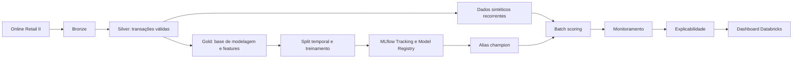

# Reactivation Next Purchase

Projeto end-to-end de dados e Machine Learning no Databricks para priorizar clientes inativos com maior probabilidade de realizar uma nova compra nos próximos 30 dias.

**Status:** encerramento da versão `v1.0.0` em andamento. O código, Bundle, Job e dashboard estão versionados. Em 2026-08-04, o deploy no target `dev` e a execução end-to-end do Job concluíram com sucesso; faltam apenas a promoção Git/GitHub, as evidências curadas e a release formal.

## Objetivo de negócio

Em um cenário de CRM, não é eficiente abordar toda a base inativa da mesma forma. O projeto gera um ranking de clientes elegíveis para que campanhas de reativação priorizem quem tem maior propensão de retorno.

> Dado o histórico disponível de um cliente inativo até uma data de referência, qual a probabilidade de ele voltar a comprar nos 30 dias seguintes?

## Contexto, dados e limitações

O dataset de referência é o [Online Retail II, da UCI Machine Learning Repository](https://archive.ics.uci.edu/dataset/502/online+retail+ii). Ele representa transações de varejo e é usado como proxy para um caso de reativação de clientes/apostadores.

Por isso, o projeto não mede resultado real de campanha, custo de incentivo, canal de comunicação ou margem por cliente. Dados sintéticos são usados apenas para testar o comportamento operacional de scoring, monitoramento e idempotência; eles não comprovam performance de negócio.

## Arquitetura e fluxo



O Job operacional executa, nesta ordem:

```text
generate_synthetic_transactions
→ batch_scoring
→ monitoring
→ explainability
→ refresh_reactivation_dashboard
```

O Job tem `max_concurrent_runs: 1`, retries nas tasks de notebook e schedule pausado. Assim, a execução final é manual e controlada.

## Contrato de modelagem e prevenção de leakage

- **Unidade de análise:** `customer_id + reference_date`.
- **Elegibilidade:** `inactive_days >= 60`.
- **Janela de observação:** 180 dias até a `reference_date`, inclusive.
- **Target:** `target_reactivated_30d = 1` quando há ao menos uma compra nos 30 dias posteriores à `reference_date`.
- **Validação:** treino, validação e teste respeitam a ordem temporal; não há split aleatório como estratégia principal.

Features usam somente informações disponíveis no momento da decisão. Compras da janela de resposta não são usadas como feature, evitando leakage temporal. O contrato completo está em [docs/problem_definition.md](docs/problem_definition.md).

## Features, modelos e avaliação

As features operacionais incluem recência (`inactive_days`), número de pedidos, itens, gasto, diversidade de produtos e países, tempo de relacionamento e métricas médias de ticket/valor. O repositório contém:

- uma baseline de ranking;
- Logistic Regression;
- XGBoost;
- otimização de hiperparâmetros com Optuna;
- avaliação com ROC-AUC, PR-AUC, precision, recall, F1, Precision@K e Lift@K.

O modelo vencedor é registrado no MLflow Model Registry e consumido pelo alias `champion` no batch scoring. Métricas e a versão final do modelo devem ser preenchidas a partir da execução final no Workspace; não há valores inventados neste README.

## Scoring, monitoramento e explicabilidade

O batch scoring recalcula as features da população elegível, gera `reactivation_score`, ranking e grupos de prioridade `TOP_10`, `TOP_20`, `TOP_30` e `REMAINDER`. A persistência é controlada por `scoring_date` para que uma reexecução da mesma rodada substitua o resultado correspondente em vez de duplicá-lo.

O monitoramento cobre qualidade de dados, volume, distribuição de scores, drift de features e scores por PSI, além de métricas de performance após a maturação da target. A explicabilidade usa contribuições nativas do XGBoost (`pred_contribs=True`) para gerar visões globais e locais.

O dashboard nativo do Databricks é versionado em [`dashboards/Reactivation Model.lvdash.json`](dashboards/Reactivation%20Model.lvdash.json) e atualizado como última task do Job.

## Databricks Asset Bundle e execução

O Bundle possui somente o target `dev`, em modo `development`. O contrato operacional confirmado no Workspace usa `workspace.silver_layer`, `workspace.synthetic_layer`, `workspace.gold_layer`, `workspace.monitoring_layer` e `workspace.explainability_layer`; o modelo registrado é `workspace.default.reactivation_customers_model`, consumido pelo alias `champion`.

```bash
# Dependências para testes locais
python -m pip install "pytest>=8.0.0" "PyYAML>=6.0.0"

# Testes Python puros
PYTHONPATH=src python -m pytest -q

# Validação e deploy no Databricks (requer autenticação válida)
databricks bundle validate -t dev
databricks bundle deploy -t dev

# Execução manual controlada do Job
databricks bundle run reactivation_customers_pipeline -t dev
```

Após a execução, valide status de todas as tasks, `run_id`, parâmetros, lote sintético, tabelas de scoring, monitoramento e explicabilidade, alias `champion`, atualização do dashboard e idempotência da mesma `scoring_date`.

## CI/CD e estratégia de branches

O workflow em [`.github/workflows/databricks-bundle.yml`](.github/workflows/databricks-bundle.yml) executa testes unitários e `databricks bundle validate --target dev` em pull requests para `dev` e `main`. O deploy ocorre somente em push para `dev`; o Job não é executado automaticamente pelo CI.

Antes da release, `dev` deve ser sincronizada com `main`, pois é a branch usada para deploy. O fluxo final esperado é validar a mudança em `dev`, fazer o deploy final, promover `dev` para `main` e então criar a tag `v1.0.0`.

## Estrutura do repositório

```text
conf/                     Configuração por ambiente
dashboards/               Dashboard Databricks versionado
docs/                     Contrato de negócio e documentação
notebooks/                Exploração, treinamento e operação do pipeline
resources/                Definição do Job no Bundle
src/reactivation_model/   Helpers reutilizáveis de configuração e qualidade
tests/                    Testes unitários locais
```

## Evidências de portfólio

As evidências devem ser geradas a partir da rodada final e armazenadas em `docs/assets/portfolio/`, removendo IDs de clientes, URLs privadas, tokens e qualquer outro dado sensível. O conjunto máximo recomendado é:

1. arquitetura ou fluxo do projeto;
2. execução verde do Job;
3. experimento e métricas no MLflow;
4. modelo com alias `champion`;
5. dashboard atualizado;
6. GitHub Actions verde.

## Limitações e trabalhos futuros

O escopo da `v1.0.0` é educacional e batch. Itens como ambiente de produção, Model Serving, Feature Store, alertas complexos, promoção automática de modelos e avaliação com dados reais de campanha são evoluções futuras e não bloqueiam o encerramento desta versão.

## Tecnologias

- Python, PySpark e Delta Lake
- Databricks, Databricks Asset Bundles e Databricks Jobs
- MLflow, scikit-learn, XGBoost e Optuna
- GitHub e GitHub Actions
